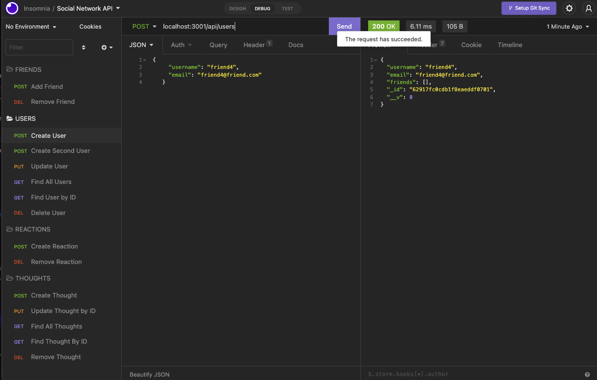
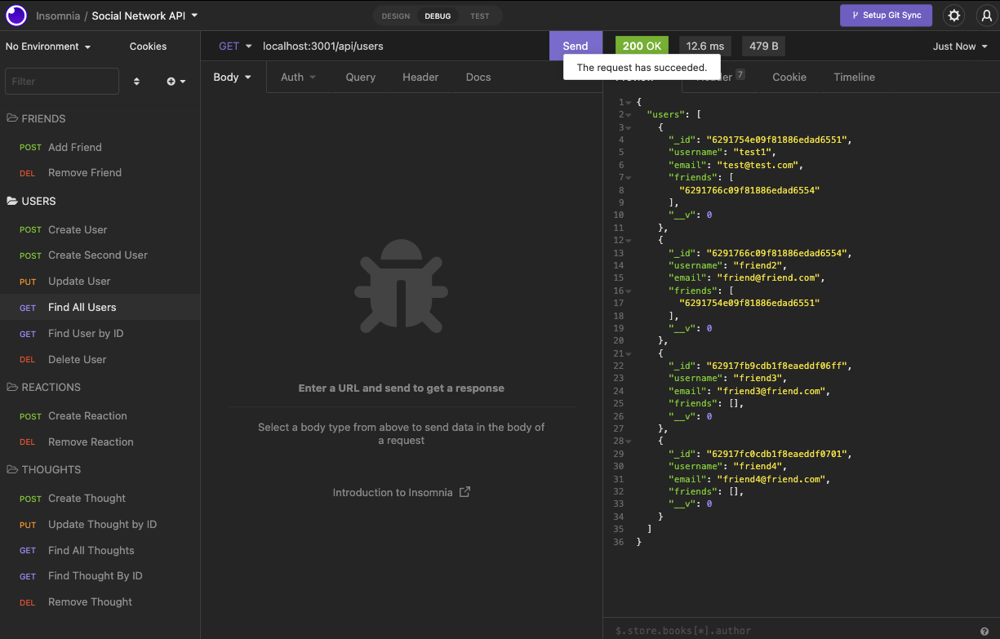
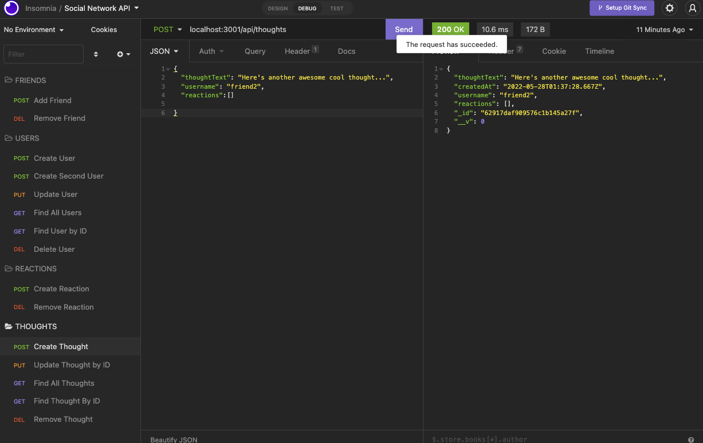

# socialnetworkAPI

## <Project Social Network API>

## Table of Contents 

* [Description](#description)

* [Technologies Used](#technologies)

* [User Guide](#User-Guide)

* [LinkToSite](#LinkToSite)

* [Questions](#questions)

## Description

This is an API for a "social network application" used to demonstrate our knowledge in NoSQL databases. A user can add themselves and then start by creating thoughts, becoming friends with other users, and adding reactions to other users thoughts. 

## Technologies

Express, Mongoose and Insomnia 

## User-Guide

Since this application is not deployed I am sharing screen shots and a walk through video, below. To get started, in your terminal, I am running 'npm start' and opening Insomnia.
 
 
You can create a new user with a unique username and email.  
 
 
 

 
 
 
You can view all users and their friends. 
 
 
 

 
 
 
You can create thoughts for each user. 
 
 
 

 
 
 
You can create reactions to each users thoughts. 
 
 
 

 
 
 
You can also add friends, remove friends, update users, remove users, remove reactions and reamove thoughts. 

## Link to Github
<https://github.com/jennyrae818/socialnetworkAPI>

## Link to video walk through
<https://drive.google.com/file/d/1DWs2nz7kYdd2VJq99LFWsGTX1Sf1ejEt/view>

## Questions

If you have any questions about the repo, open an issue or contact [jenny](undefined) directly at jennyrae818@gmail.com.