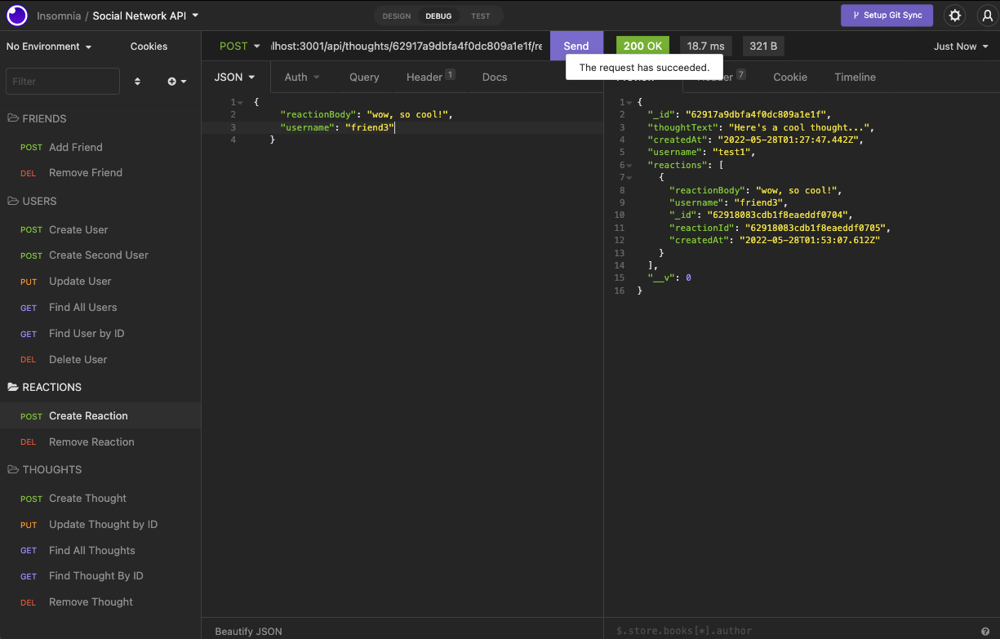

# socialnetworkAPI

## <Project Social Network API>

## Table of Contents 

* [Description](#description)

* [Technologies Used](#technologies)

* [User Guide](#User-Guide)

* [LinkToSite](#LinkToSite)

* [Questions](#questions)

## Description

This app is  

## Technologies

## User-Guide

To get started, in your terminal, type in 'node questions'
 
 
You will be presented with options of what you would like to do? To select a choice you will use the arrows on your keyboard and hit enter when you are ready to move forward. 
 
 
 

 
 
 

 
 
 

 
 
 

 
 
 

 
 
 

 
 
 

 

## Link to Github
<https://github.com/jennyrae818/socialnetworkAPI>

## Link to video walk through
<https://drive.google.com/file/d/1DWs2nz7kYdd2VJq99LFWsGTX1Sf1ejEt/view>

<https://drive.google.com/file/d/1DWs2nz7kYdd2VJq99LFWsGTX1Sf1ejEt/view>

## Questions

If you have any questions about the repo, open an issue or contact [jenny](undefined) directly at jennyrae818@gmail.com.